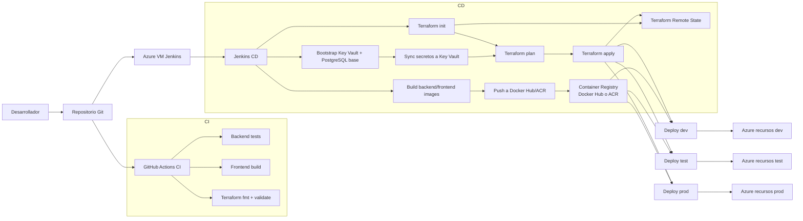

# Infraestructura

## Jerarquia de recursos

```mermaid
flowchart TD
    JenkinsVM[Jenkins VM<br/>Azure Linux VM]
    Jenkins[Jenkins Container]
    Registry[Container Registry<br/>Docker Hub o ACR]
    RemoteState[Terraform Remote State<br/>Azure Storage]

    Azure[Suscripcion Azure]

    JenkinsVM --> Jenkins
    Jenkins --> Registry
    Jenkins --> RemoteState
    Jenkins --> Azure

    Azure --> SharedRG[RG shared]

    subgraph SHARED[Base compartida]
        SharedRG --> SharedVNet[VNet shared]
        SharedRG --> SharedNSG[NSG Jenkins]
        SharedRG --> SharedPIP[Public IP]
        SharedRG --> SharedVM[Jenkins VM]
        SharedVM --> Jenkins
        SharedVNet --> SharedVM
        SharedNSG --> SharedVM
        SharedPIP --> SharedVM
    end

    Azure --> DevRG[RG dev]
    Azure --> TestRG[RG test]
    Azure --> ProdRG[RG prod]

    subgraph DEV[Ambiente dev]
        DevRG --> DevLAW[Log Analytics Workspace]
        DevRG --> DevCAE[Container Apps Environment]
        DevRG --> DevKV[Key Vault]
        DevRG --> DevSA[Storage Account]
        DevRG --> DevPG[PostgreSQL Flexible Server]
        DevRG --> DevMI[Managed Identity<br/>Container Apps]

        DevSA --> DevShare[Azure File Share<br/>attachments]
        DevCAE --> DevStorage[Environment Storage]
        DevStorage --> DevShare

        DevCAE --> DevFE[Container App frontend]
        DevCAE --> DevBE[Container App backend]
        DevKV --> DevBE
        DevKV --> DevFE
        DevMI --> DevKV

        DevFE --> DevBE
        DevBE --> DevPG
        DevBE --> DevShare
        DevCAE --> DevLAW
    end

    subgraph TEST[Ambiente test]
        TestRG --> TestLAW[Log Analytics Workspace]
        TestRG --> TestCAE[Container Apps Environment]
        TestRG --> TestKV[Key Vault]
        TestRG --> TestSA[Storage Account]
        TestRG --> TestPG[PostgreSQL Flexible Server]
        TestRG --> TestMI[Managed Identity<br/>Container Apps]

        TestSA --> TestShare[Azure File Share<br/>attachments]
        TestCAE --> TestStorage[Environment Storage]
        TestStorage --> TestShare

        TestCAE --> TestFE[Container App frontend]
        TestCAE --> TestBE[Container App backend]
        TestKV --> TestBE
        TestKV --> TestFE
        TestMI --> TestKV

        TestFE --> TestBE
        TestBE --> TestPG
        TestBE --> TestShare
        TestCAE --> TestLAW
    end

    subgraph PROD[Ambiente prod]
        ProdRG --> ProdLAW[Log Analytics Workspace]
        ProdRG --> ProdCAE[Container Apps Environment]
        ProdRG --> ProdKV[Key Vault]
        ProdRG --> ProdSA[Storage Account]
        ProdRG --> ProdPG[PostgreSQL Flexible Server]
        ProdRG --> ProdMI[Managed Identity<br/>Container Apps]

        ProdSA --> ProdShare[Azure File Share<br/>attachments]
        ProdCAE --> ProdStorage[Environment Storage]
        ProdStorage --> ProdShare

        ProdCAE --> ProdFE[Container App frontend]
        ProdCAE --> ProdBE[Container App backend]
        ProdKV --> ProdBE
        ProdKV --> ProdFE
        ProdMI --> ProdKV

        ProdFE --> ProdBE
        ProdBE --> ProdPG
        ProdBE --> ProdShare
        ProdCAE --> ProdLAW
    end

    Registry -. imagenes .-> DevFE
    Registry -. imagenes .-> DevBE
    Registry -. imagenes .-> TestFE
    Registry -. imagenes .-> TestBE
    Registry -. imagenes .-> ProdFE
    Registry -. imagenes .-> ProdBE
```

## Resumen

- Cada ambiente tiene su propio `Resource Group`.
- Dentro de cada ambiente se crean recursos aislados para `frontend`, `backend`, base de datos, adjuntos y logs.
- Los secretos de aplicacion viven en `Azure Key Vault` y se consumen desde `Container Apps` por `managed identity`.
- `Jenkins` corre dentro de una VM Linux pequena en Azure y desde ahi construye, publica imagenes y ejecuta Terraform.
- El `remote state` de Terraform vive en `Azure Storage`, separado de la app, para que el pipeline y el equipo compartan la misma referencia de infraestructura.
- El backend consume credenciales y cadenas sensibles como secretos del runtime del contenedor.
- Los adjuntos no quedan en disco efimero: se guardan en `Azure Files`.

## Justificacion del Remote State

- `Terraform` necesita un archivo de estado para saber que recursos ya existen y cuales debe crear, modificar o conservar.
- Si ese archivo quedara solo en una maquina local, el proyecto dependeria de esa maquina para seguir desplegando.
- Como en este piloto existe un `Jenkins` central y varios ambientes, el estado debe vivir en un punto compartido y confiable.
- `Azure Storage` cumple ese rol y permite que tanto el pipeline como un operador manual usen la misma fuente de verdad.
- El backend remoto no guarda imagenes Docker; las imagenes viven en `Docker Hub` o `ACR`. Aqui solo se guarda el estado de Terraform.

## Idea clave para exposicion

- El repositorio guarda el codigo de la infraestructura.
- Azure Storage guarda la memoria de esa infraestructura.
- Jenkins usa ambas cosas para automatizar despliegues repetibles a `shared`, `dev`, `test` y `prod`.

## Detalle del Stack Shared

El stack `shared` es la base comun del proyecto y su objetivo es alojar un unico `Jenkins` central.

Recursos que aplica Terraform en `shared`:

- `Resource Group` para separar la infraestructura comun de los ambientes de la aplicacion.
- `Virtual Network` y `Subnet` para dar contexto de red a la VM.
- `Network Security Group` para controlar acceso por `SSH` y por la UI de Jenkins.
- `Public IP` para exponer la VM y permitir administracion remota.
- `Network Interface` para conectar la VM con su red y su IP publica.
- `Linux Virtual Machine` como host de Docker y de Jenkins.

Valores clave del piloto:

- VM `Standard_B2s_v2`
- Ubuntu `22.04 LTS`
- autenticacion por llave `SSH`
- Jenkins expuesto por puerto `8080`

### Como explicarlo en la exposicion

- primero se despliega una capa compartida de automatizacion
- esa capa no es parte de `dev`, `test` o `prod`; es la plataforma que los opera
- Jenkins vive en una sola VM y desde ahi ejecuta el pipeline de despliegue para todos los ambientes
- esto evita duplicar servidores de CI/CD y centraliza la automatizacion del proyecto

Frase sugerida:

- “Primero desplegamos una capa compartida de automatizacion. Esa capa crea la VM unica de Jenkins con su red, seguridad e IP publica. Luego, desde ese Jenkins, desplegamos los ambientes `dev`, `test` y `prod`.”

### Alcance del stack shared

El stack `shared` no despliega la aplicacion ni su base de datos.

Solo prepara:

- el host de Jenkins
- la conectividad de red
- la seguridad minima de acceso
- la exposicion publica necesaria para operar el pipeline

## Incidencia de Cuota y Capacidad

Durante el despliegue real del stack `shared` aparecieron restricciones propias de Azure que fue necesario resolver antes de crear la VM:

- falta de capacidad del SKU `Standard_B2s` en `eastus`
- incompatibilidad de arquitectura al probar un SKU `Arm64`
- cuota `0` para la familia `Bsv2` en la suscripcion

Resolucion aplicada:

- se destruyo la base parcial de `eastus`
- se reprovisiono el intento en `centralus`
- se solicito aumento de cuota para `Standard Bsv2 Family vCPUs` a `2`
- tras la aprobacion de cuota, la VM `tigarantias-jenkins-vm` se aprovisiono correctamente

Como explicarlo:

- “Durante la ejecucion real validamos que en Azure no solo importa el codigo de Terraform. Tambien influyen la disponibilidad regional de los SKUs y las cuotas aprobadas por familia de maquinas virtuales. Ajustamos region y cuota hasta completar el despliegue sin perder el control del estado.”

## Preparacion del Host Jenkins

Una vez creada la VM compartida, el siguiente paso fue prepararla para ejecutar contenedores y operar el pipeline:

- acceso a la VM por `SSH` con llave
- instalacion de `Docker`
- habilitacion del usuario administrador para usar Docker sin `sudo`

Frase sugerida:

- “Una vez aprovisionada la VM compartida, el siguiente paso fue prepararla como host de contenedores instalando Docker y habilitando su uso para el usuario administrador.”

## Flujo CI/CD

## Resumen CI/CD

- `GitHub Actions` queda como CI de validacion continua.
- `Jenkins` queda como CD parametrizado por ambiente, corriendo en una VM Linux de Azure.
- El pipeline construye imagenes inmutables, las publica al registry, crea la base minima para secretos, sincroniza `Key Vault` y luego aplica Terraform.
- `prod` tiene compuerta manual antes del `apply`.
